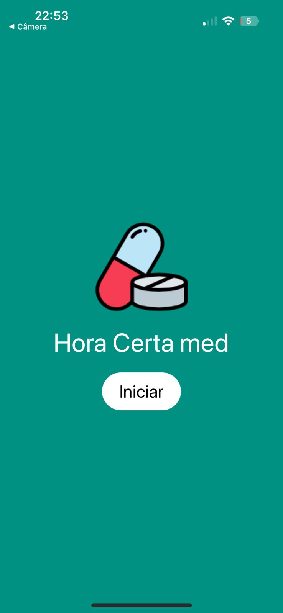
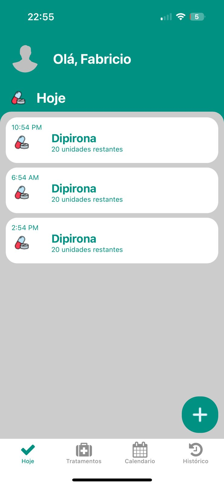
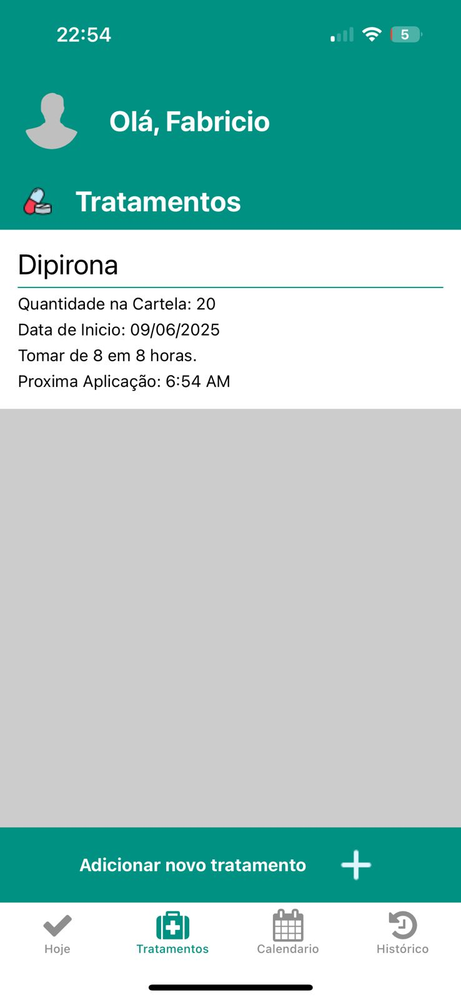
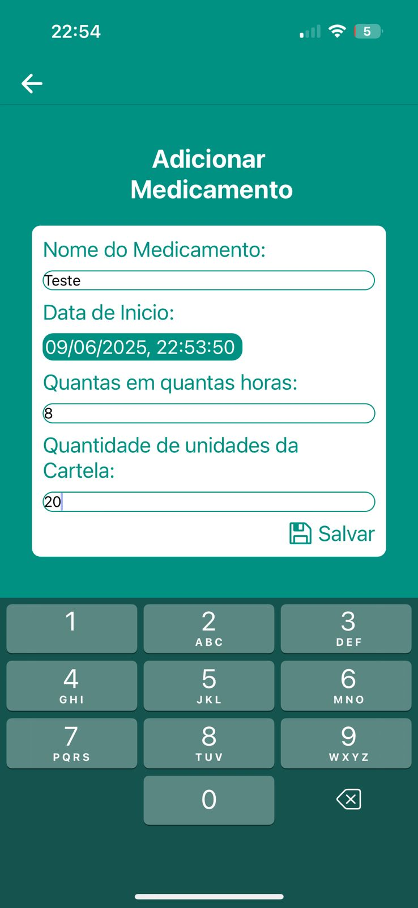

# 💊 Hora Certa Med

> Uma agenda inteligente para o gerenciamento e organização do uso de medicamentos controlados.

## 📱 Visão Geral

O **Hora Certa Med** é um aplicativo mobile desenvolvido em **React Native (Expo)** e integrado com **Firebase**. Ele permite aos usuários:

✅ Adicionar e gerenciar medicamentos controlados  
✅ Organizar o uso diário de medicamentos  
✅ Visualizar um **dashboard** com os próximos medicamentos do dia  
✅ Acessar um **histórico de uso** detalhado  
✅ Gerenciar a lista de tratamentos de forma prática e intuitiva  

🎨 O projeto utiliza uma paleta clean e funcional, com **predominância da cor principal: `#009183`**.

---

## 🚀 Tecnologias Utilizadas

- **Expo** e **React Native**  
- **Firebase** (para autenticação e armazenamento)  
- **Context API** para gerenciamento de estado global  
- **Hooks customizados** para rotinas e dados dinâmicos  

---

## ⚙️ Instalação

Clone o repositório e instale as dependências:

\`\`\`
git clone https://github.com/FabricioOliveira1/hora-certa-med.git
cd hora-certa-med
npm install
\`\`\`

Inicie o projeto com:

\`\`\`
expo start
\`\`\`

---

## 🌟 Features Planejadas

🚧 O projeto ainda está em desenvolvimento e algumas funcionalidades serão implementadas futuramente:

- 🔔 **Notificações Push** para alertar sobre horários de medicamentos  
- 📅 **Sincronização com calendário** do dispositivo   
- 💊 **Melhorias na usabilidade e UX**

---

## 📸 Imagens

  
  
  
  

---

## 📄 Licença

Este projeto está sob a licença MIT.

---

## ✏️ Contato

Desenvolvido por [Fabricio Oliveira](https://github.com/FabricioOliveira1)  
Email: [fabricioliveira021@gmail.com]  
LinkedIn: [https://www.linkedin.com/in/fabricioliveira-1/]

---

Feito com 💙 e foco em usabilidade!
